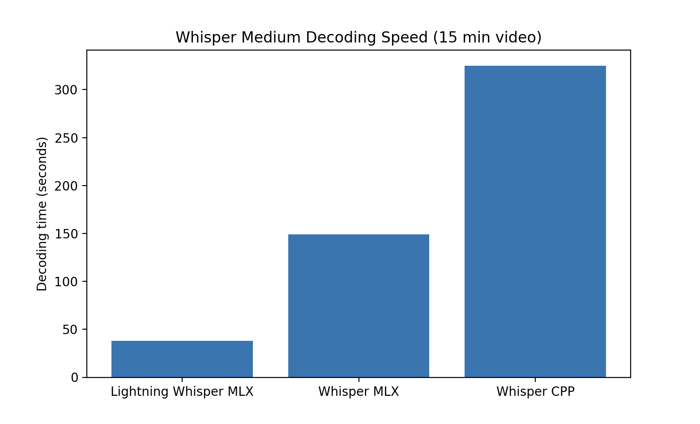

# Lightning Whisper MLX

An incredibly fast implementation of Whisper optimized for Apple Silicon.



10x faster than Whisper CPP, 4x faster than current MLX Whisper implementation.

## Features

- **Batched Decoding** -> Higher Throughput
- **Distilled Models** -> Faster Decoding (less layers)
- **Quantized Models** -> Faster Memory Movement
- _Coming Soon: Speculative Decoding -> Faster Decoding with Assistant Model_

## Installation

Install lightning whisper mlx using pip:

```bash
pip install lightning-whisper-mlx
```

## Usage

Models

```
["tiny", "small", "distil-small.en", "base", "medium", distil-medium.en", "large", "large-v2", "distil-large-v2", "large-v3", "distil-large-v3"]
```

Quantization

```
[None, "4bit", "8bit"]
```

#### Example

```python
from lightning-whisper-mlx import LightningWhisperMLX

whisper = LightingWhisperMLX(model="base", batch_size=12, quant=None)

text = whisper.transcribe(audio_path="/audio.mp3")['text']

print(text)
```

## Notes

- The default batch_size is 12, higher is better for throughput but you might run into memory issues. The heuristic is it really depends on the size of the model. If you are running the smaller models, then higher batch size, larger models, lower batch size. Also keep in mind your unified memory!

## Credits

- [Mustafa](https://github.com/mustafaaljadery) - Creator of Lightning Whisper MLX
- [Awni](https://github.com/awni) - Implementation of Whisper MLX (I built on top of this)
- [Vaibhav](https://github.com/Vaibhavs10) - Inspired me to build this (He created a version optimized for Cuda)
